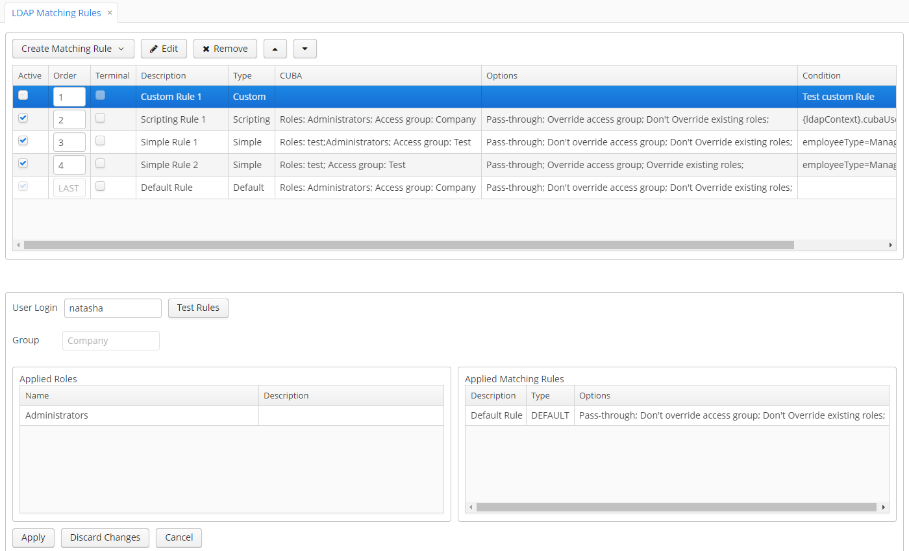
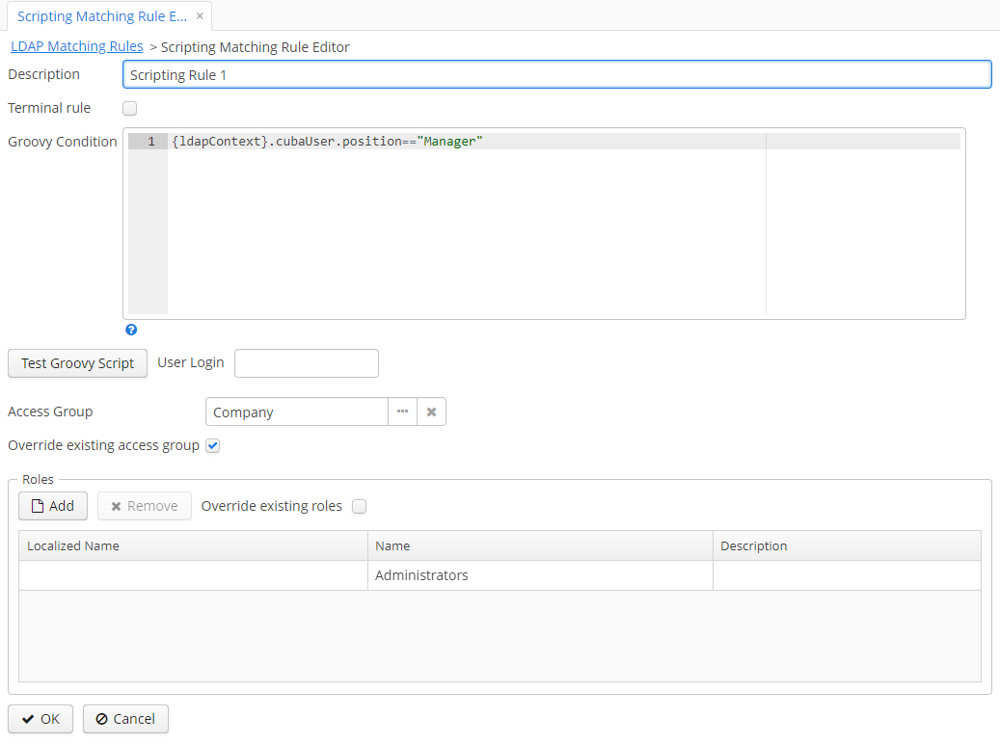
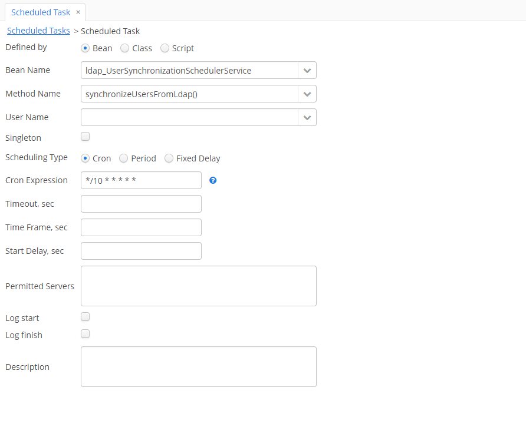

# LDAP

<p>
    <a href="http://www.apache.org/licenses/LICENSE-2.0"></a>
    <a href="https://travis-ci.org/cuba-platform/ldap-addon"></a>
</p>

- [Overview](#overview)
- [Getting Started](#getting-started)
    - [Prerequisites](#prerequisites)
    - [Installation](#installation)
      - [From the Marketplace](#from-the-marketplace)
      - [By Coordinates](#by-coordinates)
    - [Configuration](#configuration)
    - [Additional Information](#additional-information)
- [Component Functionalities](#component-functionalities)
    - [LDAP Config](#ldap-config)
    - [LDAP Matching Rules](#ldap-matching-rules)
    - [Testing LDAP Matching Rules](#testing-ldap-matching-rules)
    - [LDAP Log](#ldap-log)
- [Scheduled Task Configuration](#scheduled-task-configuration)
- [EventListeners to Interact with LDAP Add-on Events](#eventlisteners-to-interact-with-ldap-add-on-events)
- [Appendix A. Application Properties](#appendix-a)

# Overview

The LDAP integration CUBA component provides readily available instruments to enhance any CUBA-based application with the features of a directory server, e.g. Active Directory.
The component is available for CUBA applications of any complexity and does not require any additional third-party
frameworks or libraries.

The component provides the following functionality:

* Using LDAP credentials to log in to CUBA applications
* Configuring rules of role and user access group assignment
* Populating user details from the LDAP server automatically
* Logging LDAP synchronization details.

The following [sample application](https://github.com/cuba-platform/ldap-addon-demo) can be used to test the component functionality.

# Getting Started

## Prerequisites

Before enabling the add-on, configure your directory server.

## Installation

The add-on can be added to your project in one of the ways described below. Installation from the Marketplace is the simplest way. The last version of the add-on compatible with the used version of the platform will be installed.
Also, you can install the add-on by coordinates choosing the required version of the add-on from the table.

In case you want to install the add-on by manual editing or by building from sources see the complete add-ons installation guide in [CUBA Platform documentation](https://doc.cuba-platform.com/manual-latest/manual.html#app_components_usage).

## From the Marketplace

1. Open your application in CUBA Studio. Check the latest version of CUBA Studio on the [CUBA Platform site](https://www.cuba-platform.com/download/previous-studio/).
2. Go to *CUBA -> Marketplace* in the main menu.

 

3. Find the *LDAP* add-on there.


4. Click *Install* and apply the changes.
The add-on corresponding to the used platform version will be installed.

## By Coordinates

1. Open your application in CUBA Studio. Check the latest version of CUBA Studio on the [CUBA Platform site](https://www.cuba-platform.com/download/previous-studio/).
2. Go to *CUBA -> Marketplace* in the main menu.
3. Click the icon in the upper-right corner.

 

4. Paste the add-on coordinates in the corresponding field as follows:

 `com.haulmont.addon.ldap:ldap-global:<add-on version>`

 where `<add-on version>` is compatible with the used version of the CUBA platform.

 | Platform Version | Add-on Version   |
|------------------|-------------------|
| 7.2.x            | 1.5.0             |
| 7.1.x            | 1.4.0             |
| 7.0.x            | 1.3.2             |
| 6.10.x           | 1.2.0             |
| 6.9.x            | 1.1.1             |
| 6.8.x            | 1.0.1             |

5. Click *Install* and apply the changes. The add-on will be installed to your project.

## Configuration

Before using the add-on as a part of your application, configure initial values for connecting to the LDAP server and set up basic attribute names of the LDAP user in the `app.properties` file.
An example of how to set up these properties is given below. Learn more about the application properties in  [Aappendix A](#appendix-a).

```properties
ldap.contextSourceUrl = ldap://localhost:10389
ldap.contextSourceBase = dc=example,dc=com
ldap.contextSourceUserName = uid=admin,ou=system
ldap.contextSourcePassword = secret
ldap.referral = follow
ldap.sessionExpiringPeriodSec = 120
ldap.userSynchronizationBatchSize = 100
ldap.userSynchronizationOnlyActiveProperty = true
ldap.cubaGroupForSynchronization = Company
ldap.cubaGroupForSynchronizationInverse = false
ldap.synchronizeCommonInfoFromLdap = true
cuba.web.standardAuthenticationUsers = admin,anonymous

```

Then, specify the following properties in the `web-app.properties` file:

```properties
cuba.web.standardAuthenticationUsers = admin,anonymous
ldap.expiringSessionNotificationCron = */10 * * * * *
ldap.addonEnabled = true
ldap.expiringSessionsEnable = true
```

**Note:** If the component is enabled, users cannot log in to the application using CUBA credentials. However, you can permit particular users (e.g. system administrators) to log in using CUBA credentials by specifying their usernames as values of the `cuba.web.standardAuthenticationUsers` property.

## Additional Information

If you want to use the component functionality in several CUBA applications, you have to enable it for each of them separately.

# Component Functionalities

## Predefined roles

- **LDAP Admin role** - LDAP configuration role
- **Default LDAP role** - Default LDAP role, allows user to login with LDAP credentials

## LDAP Config

After installation, check that all configured property values are displayed properly
on the *LDAP Config* screen (Menu: *LDAP Component → LDAP Config*).


The screen comprises three sections: *Connection settings*, *Attribute Settings* and *Schema Settings*. The description
of each section is given below.

### LDAP Connection Settings

The *Connection settings* section allows you to preview and test LDAP connection properties from the application UI.


Clicking the *Test Connection* button at the bottom of the screen launches connection testing. If the connection is
successfully established, the corresponding message is displayed.

### Attribute Settings

When a user logs in using LDAP credentials for the first time, your CUBA application creates a new `User` entity.
The LDAP server passes all user details to the application. Make sure you provide user information when configuring your LDAP server.
The *Attribute Settings* section enables you to match LDAP attributes and the fields of the `User` entity.


### LDAP Schema

The *Schema Settings* section allows you to define what can be stored as LDAP directory entries.


Using the table, you can set up conditions of matching rule application.

Clicking the *Refresh LDAP Attributes* button uploads all attributes of the specified LDAP
user object class. You can add attributes manually by using the *Create* button.

## LDAP Matching Rules

LDAP matching rules are special rules to configure access rights for new application users (those created after
logging in via LDAP). There are four rule types intended for this purpose:
- Custom
- Default
- Simple
- Scripting.
You can create and manage LDAP matching rules using the *LDAP Matching Rule* screen (Menu: *LDAP Component →
LDAP Matching Rules*).



The screen comprises the table of matching rules and testing section. Using the table, you can enable/disable certain rules using checkboxes in the *Active* column.
The testing section allows you to check how the existing matching rules are applied to a particular user (see [Testing LDAP Matching Rules](#testing-ldap-matching-rules)).


Matching rules have order numbers defining the sequence of their application.

### Custom Rule

The LDAP component provides the means to process programmatically defined custom rules. You can create custom rules by
adding new classes to the classpath of your application. They have to be implemented as Spring beans and
provided with the `@LdapMatchingRule` annotation.
Custom rules can be viewed from the application UI. However, you cannot configure or edit them there.

The advantage of custom rules is that they allow you to specify conditions not related to LDAP attributes
or schema. The example of a custom rule is provided below.

```java
@Component
@LdapMatchingRule(name = "Custom Rule 1", condition = "Test Rule")
public class TestCustomRule implements CustomLdapMatchingRule {
    @Inject
    private LdapUserDao ldapUserDao;

    @Inject
    private CubaUserDao cubaUserDao;

    @Override
    public boolean applyCustomMatchingRule (LdapMatchingRuleContext ldapMatchingRuleContext) {
        if (ldapMatchingRuleContext.getLdapUser().getLogin().equalsIgnoreCase("barts")) {
            User admin = cubaUserDao.getCubaUserByLogin("admin");
            ldapMatchingRuleContext.getRoles().add(admin.getUserRoles().get(0).getRole());
            ldapMatchingRuleContext.setGroup(admin.getGroup());
        }
        return true;
    }
}
```

### Default Rule

When you launch your application for the first time after component installation, the system automatically creates the default rule.

It is used if none of other rules were applied, i.e. conditions for applying the existing rules were not met. The system always applies the default rule the last. That is why it contains the `LAST` value in the *Order* field.

You can edit the default rule by clicking the *Edit* button. All fields and settings present in *Default
Matching Rule Editor* are described in the section below.

#### Default Matching Rule Editor


* *Description*: a short description of the default rule.
* *Terminal rule*: if checked, then rules coming after the current one (according to the rule order) are not applied.
* *Access group*: an access group to be assigned to the user, if the default rule is applied.
* *Override existing access group*: if checked, then the system removes the previously assigned access group and uses the one specified in the *Access group* field.
* *Override existing roles*: if checked, then the system removes all previously assigned roles and uses the ones
specified in the 'Roles' section.

The *Roles* table allows you to create a set of roles to be assigned to a user, if the default rule is used.

### Simple Rule

Simple rules grant access rights (by assigning an access group and roles) to users, if the specified conditions are met.
To create a simple rule, select the *Create Simple Rule* option from the menu of the *Create Matching Rule* button.

#### Simple Matching Rule Editor


*Simple Matching Rule Editor* comprises settings and tables to configure simple matching rules:

1. __General details and settings__. The fields are similar to the ones described in [Default Matching
Rule Editor](#default-matching-rule-editor).
2. __Conditions__. The section enables you to add conditions to be met for successful rule application. Click
the *Create* button to open *Simple Rule Condition Editor*.


The editor contains the following fields:

* *Attribute*: an LDAP attribute to be checked before applying the current simple rule.

 **Note:** Before creating conditions it is required to add them to the existing LDAP Schema (for more details,
refer to [LDAP Schema](#ldap-schema)).

* *Attribute Value*: a value of the selected attribute. The system applies the rule to those user entities having the specified value of the selected attribute.


3. **Roles**. In this section, you can add user roles to be assigned to the user in case of successful rule
application.

### Scripting Rule

You can provide a Groovy script with a set of conditions to be met to grant a user access rights. To create a new scripting rule, select the *Create Scripting Rule* option from the *Create matching rule* button menu.

#### Scripting Matching Rule Editor

*Scripting Matching Rule Editor* contains a set of general fields (these fields are similar to the ones described in
[Default Matching Rule Editor](#default-matching-rule-editor)), a section for specifying and testing Groovy scripts
and a table of roles.



The component uses the specified condition to evaluate the matching rule context. Note that the `{ldapContext}` placeholder has to
be used as an alias for the LDAP matching rule context. The `{ldapContext}` provides the following fields:

* *ldapUser*: main LDAP person properties (login, cn, sn, email, memberOf, accessGroups, isDisabled, position,
language, ou)
* *appliedRules*: matching rules that were applied to the context
* *roles*: previously assigned user roles
* *group*: an access group that the user currently belongs to
* *cubaUser*: a CUBA user to whom a current matching rule is applied.
* *isTerminalRuleApply*: if checked, a current rule is a terminal one, i.e. once it is used, no other rules are applied.

## Testing LDAP Matching Rules

After creating all required matching rules, you can test them right from the *LDAP Matching Rule* screen. For this
purpose, enter a user login in the corresponding field and click *Test Rules*.

After that, the applied matching rules, access groups and roles are displayed in the corresponding fields and tables. This functionality is useful when you need to check the accuracy of rule application.

## LDAP Log

You can use the *LDAP Log* screen to view all activities related to LDAP connection from the application UI.
This includes user authentication checks, rule application, user entity updates and errors that occur while using the component
features.


In order to view any log entry, just double-click it, or select it in the table and click the *View* button.

Clicking the *Excel* button enables you to download details of the selected rows (or all rows if required) to an `*.XLS` file.

# Scheduled Task Configuration

Before setting up scheduled tasks, make sure that [application properties](#appendix-a) are
configured in the `web-app.properties` and `app.properties` files.

There are several scheduled tasks that you can configure for the LDAP component:
* `checkExpiredSessions()`: checks if a new access group or role was assigned to the current user, or if they were
activated/deactivated.
* `killExpiredSessions()`: terminates the current user session, if the user was activated/deactivated, or a new access group/set of roles was assigned to them.
* `synchronizeUsersFromLdap()`: synchronizes CUBA user details in accordance with their state in LDAP.

In order to register scheduled tasks in your application, follow the guidelines below.

## Scheduled Task to Check User Sessions

1. Open *Menu: Administration → Scheduled Tasks*.
2. Click the *Create* button.
3. Fill in the required fields as follows:
    * *Bean Name:* `ldap_UserSynchronizationSchedulerService`
    * *Method Name:* `checkExpiredSessions()`
    * *Scheduling Type:* Cron
    * *Cron Expression:* specify a required cron expression (see [documentation](https://doc.cuba-platform.com/manual-latest/scheduled_tasks_cuba_reg.html) for more details)

  

4. Click *OK* to save the changes.
5. Activate the created task by clicking the corresponding button on the *Scheduled Tasks* screen.

## Scheduled Task to Kill User Sessions

1. Open *Menu: Administration → Scheduled Tasks*.
2. Click the *Create* button.
3. Fill in the required fields as follows:
    * *Bean Name:* `ldap_UserSynchronizationSchedulerService`
    * *Method Name:* `killExpiredSessions()`
    * *Scheduling Type:* Cron
    * *Cron Expression:* specify a required cron expression (see [documentation](https://doc.cuba-platform.com/manual-latest/scheduled_tasks_cuba_reg.html) for more details)

  

4. Click *OK* to save the changes.
5. Activate the created task by clicking the corresponding button on the *Scheduled Tasks* screen.

## Scheduled Task to Synchronize Users

1. Open *Menu: Administration → Scheduled Tasks*.
2. Click the *Create* button.
3. Fill in the required fields as follows:
    * *Bean Name:* `ldap_UserSynchronizationSchedulerService`
    * *Method Name:* `synchronizeUsersFromLdap()`
    * *Scheduling Type:* Cron
    * *Cron Expression:* specify a required cron expression (see [documentation](https://doc.cuba-platform.com/manual-latest/scheduled_tasks_cuba_reg.html) for more details)

  

4. Click *OK* to save the changes.
5. Activate the created task by clicking the corresponding button on the *Scheduled Tasks* screen.

## Enabling Scheduled Tasks

1. Open *Menu: Administration → Application Properties*.
2. Set the value of the *cuba.schedulingActive* property to `true`.


After you have created the scheduled tasks and enabled scheduling, the system will check user sessions once in the specified
period of time.

If there are any changes related to access groups, user roles or user status (i.e. activation/deactivation),
the system shows the notification that the current session is about to expire and terminates it once the time threshold is passed.

If user details change on the LDAP server side, the component updates CUBA user details as well.

# EventListeners to Interact with LDAP Add-on Events

In order to make your application react to the events related to the LDAP component, register the `@Component` methods
as event listeners using the `@EventListener` annotation. The example of how to configure an event listener is given below:

```java
import org.springframework.context.event.EventListener;

@Component
public class LdapEventListener {

    @EventListener
    public void userCreatedFromLdap(UserCreatedFromLdapEvent event) {
      // handles user creation event
    }
}
```

## Event types

The application component supports the following LDAP event types:

*  `BeforeUserRolesAndAccessGroupUpdatedFromLdapEvent`: defines the state of the CUBA user before matching rule application, i.e.
before the system assigns user roles and an access group to them.
*  `AfterUserRolesAndAccessGroupUpdatedFromLdapEvent`: defines the state of the CUBA user after matching rule application, i.e.
after the system assigns user roles and an access group to them.
*  `UserCreatedFromLdapEvent`: describes the state of the new CUBA user, i.e. after logging in using LDAP credentials.
*  `UserActivatedFromLdapEvent`: defines the state of the CUBA user that was previously inactive and then activated.
*  `UserDeactivatedFromLdapEvent`: defines the state of the CUBA user that was previously active and then deactivated.

# Appendix A. Application Properties <a name='appendix-a'></a>
Before working with the component you need to configure application properties. Specify them in the `app.properties` and `web-app.properties` files of your application.

## `app.properties`

#### ldap.contextSourceUrl

* **Description:** defines a URL for reaching an LDAP server.
* **Default value:** ldap://localhost:10389

#### ldap.contextSourceBase

* **Description:** defines a base DN. If configured, all LDAP operations on contexts retrieved from this ContextSource
relate to this DN. The default value is an empty distinguished name (i.e. all operations relate to the directory root).
* **Default value:** dc=springframework,dc=org

#### ldap.contextSourceUserName

* **Description:** indicates a username (principal) used for authentication. This is normally the distinguished name
of the admin user.
* **Default value:** uid=admin,ou=system

#### ldap.contextSourcePassword

* **Description:** defines a password used for authentication.
* **Default value:** secret

#### ldap.referral

* **Description:** defines the strategy to handle referrals, as described in [this documentation](http://docs.oracle.com/javase/jndi/tutorial/ldap/referral/jndi.html).
* **Default value:** follow

#### ldap.sessionExpiringPeriodSec

* **Description:** indicates a period in seconds after which the system terminates a user session, if you deactivate the user or
assign a new access group / matching rules to them.
* **Default value:** 30

#### cuba.web.standardAuthenticationUsers

* **Description:** defines users that can log in to the system using standard CUBA credentials.
* **Default value:** admin,anonymous

#### ldap.userSynchronizationBatchSize

* **Description:** defines the number of users that can be synchronized during the execution of the
[`synchronizeUsersFromLdap()`](#scheduled-task-to-synchronize-users) scheduled task.
* **Default value:** 100

#### ldap.userSynchronizationOnlyActiveProperty

* **Description:** if set to `true`, the [`synchronizeUsersFromLdap()`](#scheduled-task-to-synchronize-users) scheduled task
updates only the value of the *Active* attribute. Otherwise, the system updates all user details.
* **Default value:** true

#### ldap.cubaGroupForSynchronization

* **Description:** defines access groups that are checked when the system executes the [`synchronizeUsersFromLdap()`](#scheduled-task-to-synchronize-users) scheduled task.
* **Default value:** Company

#### ldap.cubaGroupForSynchronizationInverse

* **Description:** if set to `true`, then the system checks all groups when executing the [`synchronizeUsersFromLdap()`](#scheduled-task-to-synchronize-users) scheduled task (except for the ones specified in `ldap.cubaGroupForSynchronization`).
* **Default value:** false

#### ldap.synchronizeCommonInfoFromLdap

* **Description:** if set to `true`, then the [`synchronizeUsersFromLdap()`](#scheduled-task-to-synchronize-users) scheduled task
updates the values of the following user attributes in accordance with their state on the LDAP server side:
 Email, Name, First name, Last name, Middle name, Position, Language).
* **Default value:** true

## `web-app.properties`

#### cuba.web.standardAuthenticationUsers

* **Description:** defines users that can log in to the system using standard CUBA credentials.
* **Default value:** admin,anonymous

#### ldap.expiringSessionNotificationCron

* **Description:** defines the cron expression for retrieving expired sessions from the middleware layer.
* **Default value:** */10 * * * * *

#### ldap.addonEnabled

* **Description:** if set to `true`, then the LDAP add-on is enabled.
* **Default value:** true

#### ldap.expiringSessionsEnable

* **Description:** if set to `true`, the system sends notifications to inform the user that their session is about to expire.
* **Default value:** true
